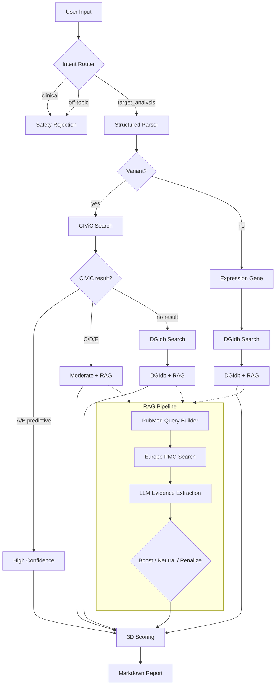
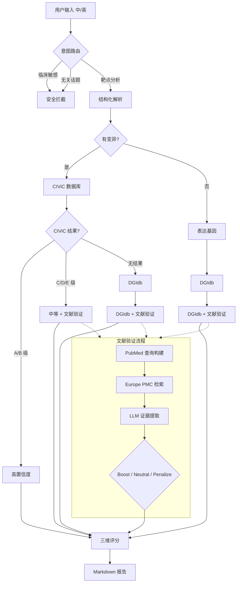

# 🧬 OncoTargetMind Agent

<p align="center">
  <a href="#english">English</a> | <a href="#chinese">中文</a>
</p>

---

<a id="english"></a>

AI-powered **cancer therapeutic target discovery** agent for precision oncology research.

> Input genomic variants & expression changes → **find matched drugs** → **rank by evidence** → **literature-verified report**.

## 🧠 How It Works



## 🚀 Quick Start

```bash
git clone https://github.com/YOUR_USERNAME/OncoTargetMind-Agent.git
cd OncoTargetMind-Agent
pip install -r requirements.txt
```

Create `.env` file with your DeepSeek API key:

```
DEEPSEEK_API_KEY=sk-your-key-here
```

Run:

```bash
# Streamlit UI (recommended for testing)
python run_ui.py

# Or FastAPI server
python run_api.py
```

## 📊 Data Sources

| Source | Type | Coverage |
|--------|------|----------|
| [CIViC](https://civicdb.org) | Expert-curated variant evidence (A–E levels) | Variants in cancers |
| [DGIdb](https://dgidb.org) | Drug-gene interaction database | Genome-wide |
| [Europe PMC](https://europepmc.org) | Biomedical literature (abstracts) | 40M+ papers |
| DeepSeek API | LLM for parsing, routing, evidence extraction | — |

## 🏗️ Architecture

```
agent/
├── state.py           # Data models (AgentState, CandidateTarget, etc.)
├── router.py          # Intent router (rule blocklist + LLM classifier)
├── parser.py          # Rule-based fallback parser
├── nodes.py           # 5 LangGraph nodes (router → parser → candidate → scoring → report)
├── graph.py           # LangGraph workflow + conditional edges
├── knowledge.py       # Local fallback knowledge base
└── scoring.py         # 3-dimension scoring (30 pts max)

tools/
├── model_loader.py    # DeepSeek API client
├── civic.py           # CIViC v2 GraphQL client
├── evidence.py        # Layered evidence engine (CIViC → DGIdb → KB)
├── literature_query.py # RAG trigger + PubMed query builder
├── literature_search.py # Europe PMC REST API
└── literature_extract.py # LLM evidence summarization

app/
├── api.py             # FastAPI (POST /analyze)
└── streamlit_app.py   # Streamlit UI
```

## 🔬 Example

**Input** (free-text):

> Endometrial cancer sample with PTEN downregulation, PIK3CA mutation, CCND1 upregulation. Evaluate potential therapeutic targets.

**Result:**

| # | Target | Score | Source | Matched Drugs |
|---|--------|-------|--------|---------------|
| 1 | PIK3CA | 27/30 | CIViC (B-level, matched) | Taselisib, Capivasertib, Palbociclib |
| 2 | CCND1 | 13/30 | DGIdb + RAG ↑ | Palbociclib, Ribociclib, Abemaciclib |
| 3 | PTEN | 13/30 | DGIdb + RAG ↑ | Ipatasertib, Capivasertib, Everolimus |

<details>
<summary>🔍 PIK3CA — CIViC matched (click to expand)</summary>

| Dimension | Score | Reasoning |
|-----------|-------|-----------|
| Druggability | 10 | CIViC B-level, predictive evidence |
| Specificity | 8 | Tumor matched: Endometrial Cancer |
| Evidence Level | 9 | CIViC base + tumor match (+1) |

**Matched Drugs** (14): Taselisib, Capivasertib, Pictilisib, Palbociclib, Temsirolimus, Trametinib, Everolimus, Ridaforolimus, Cabozantinib, plus 5 more.

> 🔬 *CIViC: 10 items, best level B, predictive, tumors matched by string matching. No RAG triggered — CIViC quality sufficient.*
</details>

<details>
<summary>📚 CCND1 — RAG-triggered with literature evidence (click to expand)</summary>

| Dimension | Score | Reasoning |
|-----------|-------|-----------|
| Druggability | 5 | DGIdb drugs found, cancer context unverified |
| Specificity | 5 | Has drug interactions |
| Evidence Level | 3 | DGIdb-only base |

**Matched Drugs** (23): Palbociclib, Ribociclib, Abemaciclib, Briciclib, Tagitinin A, plus 18 more.

---

**Literature Assessment** — `moderate` (confidence: medium) · Action: ⬆ BOOST

**Evidence Types**: driver, therapeutic_target, drug_sensitivity, functional, preclinical

> CCND1 overexpression is implicated in endometrial cancer. Paper 2 (PMID 39940659) shows CCND1 overexpression is common in early-stage endometrioid carcinoma. Paper 4 (PMID 41560755) directly links CCND1/CDK4/6 axis to CDK4/6 inhibitor sensitivity in endometrial cancer, demonstrated via CRISPR screens and functional assays.

**Limitations**: Preclinical only; no clinical trial data yet.

**Source**: EXPRESSION_GENE_CONTEXT_NEEDED · 5 papers via 3 queries

| 📄 PMID | Title | Year |
|---------|-------|------|
| 41744888 | Endocrine Therapy for Endometrial Carcinoma | 2026 |
| 39940659 | Cyclin D1 Expression: Prognostic Value in Endometrial Cancer | 2025 |
| 41560755 | NEK6 as determinant of CDK4/6 inhibitor sensitivity in EC | 2025 |

</details>

<details>
<summary>📚 PTEN — RAG-triggered with literature evidence (click to expand)</summary>

| Dimension | Score | Reasoning |
|-----------|-------|-----------|
| Druggability | 5 | DGIdb drugs found |
| Specificity | 5 | Has drug interactions |
| Evidence Level | 3 | DGIdb-only base |

**Matched Drugs** (22): Ipatasertib, Capivasertib, Everolimus, AZD8186, AKT Inhibitor MK2206, plus 17 more.

---

**Literature Assessment** — `moderate` (confidence: medium) · Action: ⬆ BOOST

**Evidence Types**: therapeutic_target, preclinical

> PTEN-deficient mouse model of endometrioid endometrial cancer suggests HDAC1 inhibition as therapeutic target (PMID 41563767). Review discusses PTEN mutations in endometrial cancer and synthetic lethality concept (PMID 41383404).

**Limitations**: Preclinical only (mouse models); no clinical data.

**Source**: EXPRESSION_GENE_CONTEXT_NEEDED · 5 papers via 3 queries

</details>

## ⚠️ Disclaimer

This tool is for **research use only**. It does not provide diagnosis, treatment recommendations, drug selection, dosage advice, or prognosis. Always consult a licensed oncologist for clinical decisions.

## 📄 License

MIT

---

<a id="chinese"></a>

## 🧬 OncoTargetMind Agent（中文）

面向精准肿瘤学研究的 **AI 靶点发现智能体**。

> 输入基因组变异与表达变化 → **匹配药物** → **证据排序** → **文献验证报告**

## 🚀 快速开始

```bash
git clone https://github.com/YOUR_USERNAME/OncoTargetMind-Agent.git
cd OncoTargetMind-Agent
pip install -r requirements.txt
```

创建 `.env` 文件写入 DeepSeek API key：

```
DEEPSEEK_API_KEY=sk-你的key
```

运行：

```bash
python run_ui.py    # Streamlit 界面（推荐）
python run_api.py   # FastAPI 服务
```

## 🧠 工作流程



## 📊 数据来源

| 来源 | 类型 | 覆盖范围 |
|------|------|----------|
| [CIViC](https://civicdb.org) | 专家审编变异证据（A–E 级） | 癌症中的变异 |
| [DGIdb](https://dgidb.org) | 药物-基因交互数据库 | 全基因组 |
| [Europe PMC](https://europepmc.org) | 生物医学文献（摘要） | 4000 万+ 论文 |
| DeepSeek API | 解析 / 路由 / 证据提取 | — |

## 🏗️ 架构

```
agent/
├── state.py           # 数据模型
├── router.py          # 意图路由（规则黑名单 + LLM 分类）
├── parser.py          # 规则降级解析器
├── nodes.py           # 5 个 LangGraph 节点
├── graph.py           # LangGraph 工作流 + 条件边
├── knowledge.py       # 本地知识库兜底
└── scoring.py         # 三维评分（满分 30）
...
```

## 🔬 示例

**输入**（自由文本）：

> 子宫内膜癌样本中 PTEN 下调，PIK3CA 突变，CCND1 上调，请评估潜在靶点。

**结果**：

| # | 靶点 | 评分 | 来源 | 匹配药物 |
|---|------|------|------|----------|
| 1 | PIK3CA | 27/30 | CIViC (B 级, 癌种匹配) | Taselisib, Capivasertib, Palbociclib |
| 2 | CCND1 | 13/30 | DGIdb + 文献 ↑ | Palbociclib, Ribociclib, Abemaciclib |
| 3 | PTEN | 13/30 | DGIdb + 文献 ↑ | Ipatasertib, Capivasertib, Everolimus |

<details>
<summary>🔍 PIK3CA — CIViC 直接匹配（点击展开）</summary>

| 维度 | 评分 | 依据 |
|------|------|------|
| 成药性 | 10 | CIViC B 级 predictive 证据 |
| 特异性 | 8 | 癌种匹配：Endometrial Cancer |
| 证据等级 | 9 | CIViC 基础分 + 癌种加分 (+1) |

**匹配药物** (14): Taselisib, Capivasertib, Pictilisib, Palbociclib, Temsirolimus, Trametinib, Everolimus 等。

> 🔬 CIViC 10 条证据，最高 B 级，predictive，字符串匹配到子宫内膜癌。无需触发文献检索——CIViC 质量足够。
</details>

<details>
<summary>📚 CCND1 — 触发文献检索（点击展开）</summary>

| 维度 | 评分 | 依据 |
|------|------|------|
| 成药性 | 5 | DGIdb 有药物交互，癌种特异性未验证 |
| 特异性 | 5 | 有药物交互 |
| 证据等级 | 3 | DGIdb-only 基础分 |

**匹配药物** (23): Palbociclib, Ribociclib, Abemaciclib, Briciclib 等。

---

**文献评估** — `moderate`（confidence: medium）· Action: ⬆ BOOST

**证据类型**: driver, therapeutic_target, drug_sensitivity, functional, preclinical

> CCND1 过表达与子宫内膜癌相关。PMID 39940659 显示 CCND1 在早期子宫内膜样癌和增生中高表达，提示驱动和预后作用。PMID 41560755 通过 CRISPR 筛选和功能实验直接证实 CCND1/CDK4/6 轴可作为 CDK4/6 抑制剂治疗靶点。

**局限**: 仅临床前数据（细胞系和动物模型），无临床试验。

**来源**: EXPRESSION_GENE_CONTEXT_NEEDED · 5 篇文献 via 3 条查询

| 📄 PMID | 标题 | 年份 |
|---------|------|------|
| 41744888 | Endocrine Therapy for Endometrial Carcinoma | 2026 |
| 39940659 | Cyclin D1 Expression in Endometrial Cancer | 2025 |
| 41560755 | NEK6 and CDK4/6 inhibitor sensitivity in EC | 2025 |

</details>

<details>
<summary>📚 PTEN — 触发文献检索（点击展开）</summary>

| 维度 | 评分 | 依据 |
|------|------|------|
| 成药性 | 5 | DGIdb 有药物交互 |
| 特异性 | 5 | 有药物交互 |
| 证据等级 | 3 | DGIdb-only 基础分 |

**匹配药物** (22): Ipatasertib, Capivasertib, Everolimus, AZD8186 等。

---

**文献评估** — `moderate`（confidence: medium）· Action: ⬆ BOOST

**证据类型**: therapeutic_target, preclinical

> PTEN 缺失的子宫内膜样癌小鼠模型中，HDAC1 抑制可能是治疗靶点 (PMID 41563767)。综述讨论了子宫内膜癌中 PTEN 突变与合成致死概念 (PMID 41383404)。

**局限**: 仅临床前（小鼠模型）；无临床数据。

**来源**: EXPRESSION_GENE_CONTEXT_NEEDED · 5 篇文献 via 3 条查询

</details>

## ⚠️ 免责声明

本工具仅供**科研使用**。不提供诊断、治疗方案选择、用药建议、剂量推荐或预后判断。临床决策请咨询正规医院肿瘤科医生。

## 📄 许可证

MIT

